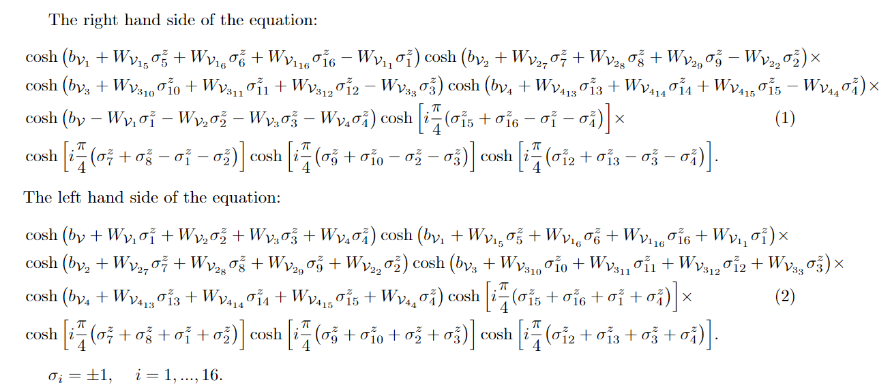

# Optimization
Create optimization algorithms for quantum machine learning.
This repository mainly creates numerical methods for quantum neural network states. It will regroup three different cases of quantum many-body systems.

### First case
Want to find optimal parameters of

